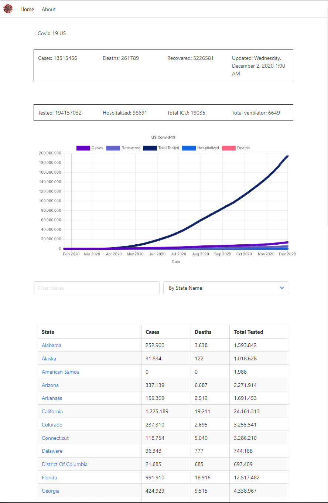

# Svelte Covid-19 Tracker for the US

A Covid 19 Tracker App written in [Svelte](https://svelte.dev/) running on Nodejs. Follow the amazing [Tutorial](https://youtu.be/ujbE0mzX-CU) by Noah.  
Uses the [Covidtracking.com](https://covidtracking.com/data/api) API and visualises the data.

⚡[LIVE](https://michaelbrunn3r.github.io/tut-svelte-covid19-us/)

## Setup
- clone the repo
- `npm install`
- `npm run dev`

